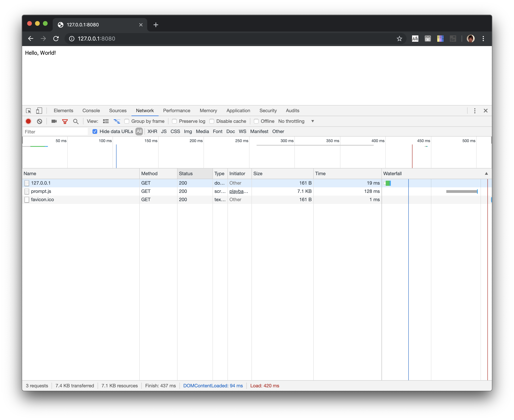
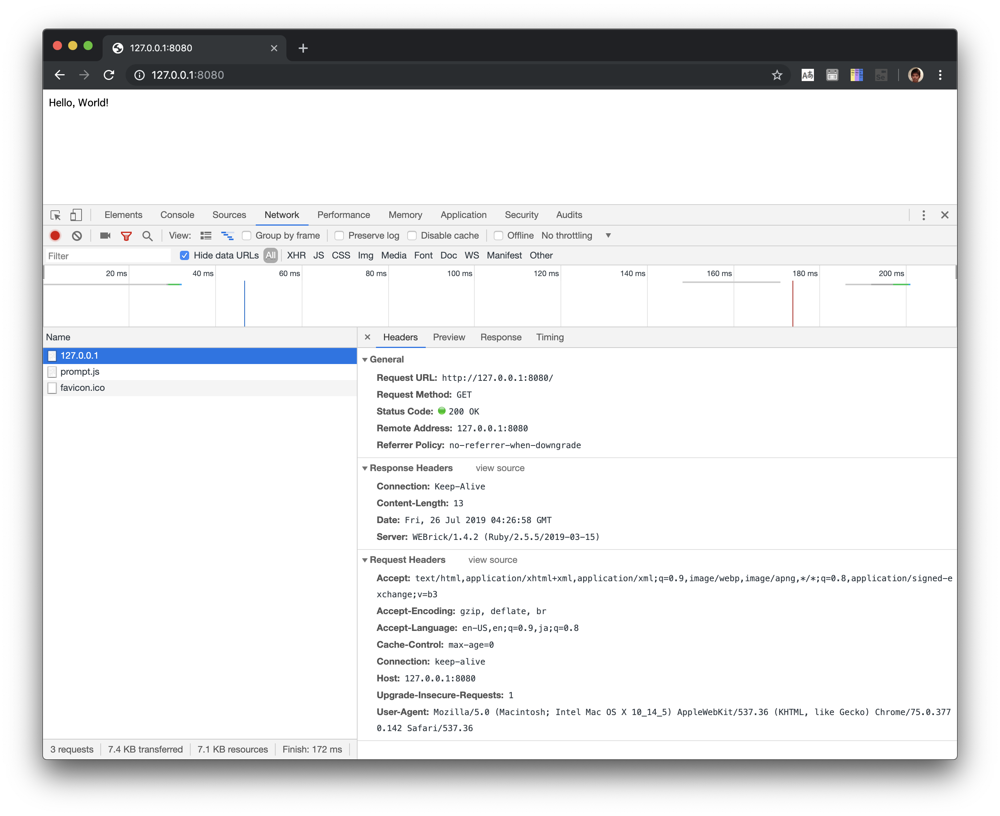

# Hello, World!

## 動かしてみる

### ターミナルA

```
$ cd path/to/http_tutorial/01_hello_world
$ ruby server.rb
```

### ブラウザ

http://127.0.0.1:8080/ をChromeで開く

### ターミナルB

HTTP(S)でのリクエストをコマンドで送信する際はcurlを使うことが多いです。

```
$ curl http://127.0.0.1:8080/
Hello, World!
```

より低レベルな `nc` コマンドを使うこともできます。

```
$ echo "GET /" | nc 127.0.0.1 8080
Hello, World!
```

## 通信を見てみる

### curl

```
$ curl http://127.0.0.1:8080/ -v
*   Trying 127.0.0.1...
* TCP_NODELAY set
* Connected to 127.0.0.1 (127.0.0.1) port 8080 (#0)
> GET / HTTP/1.1
> Host: 127.0.0.1:8080
> User-Agent: curl/7.54.0
> Accept: */*
> 
< HTTP/1.1 200 OK 
< Server: WEBrick/1.4.2 (Ruby/2.5.5/2019-03-15)
< Date: Fri, 26 Jul 2019 06:50:25 GMT
< Content-Length: 13
< Connection: Keep-Alive
< 
* Connection #0 to host 127.0.0.1 left intact
Hello, World!
```

### ブラウザ

1. Chromeを開く
1. `Developer tools` の `Network` を開く
1. URLに http://127.0.0.1:8080/ を入力する
    リクエストが送信され、Networkに通信の結果が出力される
    
1. 該当するリクエストの内容を表示する
    

## プロトコルを調べる方法を知る

プロトコルとは通信を行うための手順やフォーマットを指す。
curlとサーバ、あるいはブラウザとサーバが通信を行う方法もプロトコルに則って行われる。

概要レベルならば https://ja.wikipedia.org/wiki/Hypertext_Transfer_Protocol がわかり易いが、Wikipediaは間違った内容が含まれていることもある。
入門レベルならば http://www.tohoho-web.com/ex/http.htm#request がわかり易い。
細かい点を調べるならば https://developer.mozilla.org/ja/docs/Web/HTTP/Messages も良いだろう。

プロトコルはブラウザやサーバの開発者などによって提案、実装されるが、その仕様はRFCで定義されるので、厳密な仕様は、RFCを参照するべきである。

現時点での仕様は RFC 7230 から 7235 で定義されるが、量が多いので、基本的な部分だけであれば、RFC2616の方が読みやすいかもしれない。

- https://triple-underscore.github.io/RFC723X-ja.html
- https://triple-underscore.github.io/rfc-others/RFC2616-ja.html#section-3

RFCでは厳密に仕様が決められているので、最終的な定義の確認が必要になったらRFCを確認する必要があるが、
一般的な使用方法であればRFCを参照しなければならないことは極稀である。なので重要なのはRFCを読むことではない。
